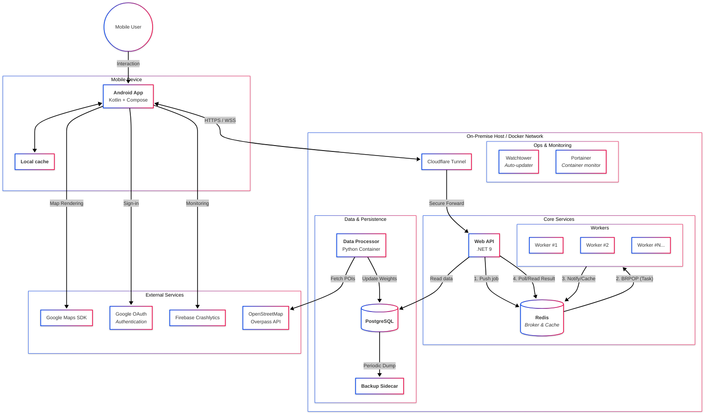
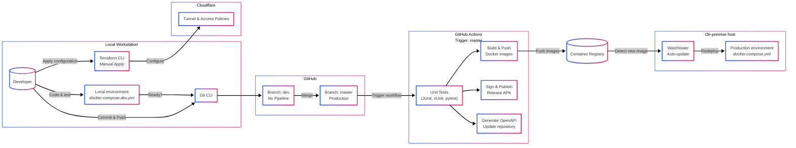

# City Explorer

Gamify urban exploration by turning the real world into a hexagonal strategy board using GPS location.

## Download application

  

> _You have to allow instalation from unknown sources._

## About

City Explorer is a mobile platform designed to encourage physical activity through location-based competition. The world is divided into a hexagonal grid, where users compete to "conquer" territories by physically spending time within them. The system dynamically weights areas based on their real-world popularity (POIs).

## Screenshots

  
  
  
  
  

  
  

## ⚙️ Core Mechanics

The system relies on a complex geospatial model rather than simple coordinates:

- **Hexagonal World Model:** Cities are tessellated into hexagons, creating a discrete grid for gameplay.
- **Dynamic Weighting Algorithm:** Each hexagon has a unique value calculated via Python scripts, analyzing the density of Points of Interest (POIs) extracted from OpenStreetMap.
- **Time-Based Discovery:** To "claim" a hexagon, a user must maintain GPS presence within its boundaries. The required duration scales dynamically with the hexagon's importance (weight).
- **Competitive Leaderboards:** Real-time scoring system based on the quality and quantity of discovered territories.

## Technical Highlights

### Architecture Diagram

### DevOps / CI/CD Diagram

### Mobile App (Kotlin & Jetpack Compose)

Built with a focus on performance and battery efficiency during background tracking.

- **Background Location Services:** Robust state management for tracking user location even when the app is minimized (Foreground Service).
- **Smart Caching:** Implemented local caching strategy to minimize API calls and data usage.
- **Interactive Route Planning:** UI for the "Mystery Walk" feature, allowing users to define time budgets and visualize AI-generated exploration paths on the hexagonal grid.
- **Google Maps SDK:** Custom styling and overlay management for rendering hexagonal grids.
- **Authentication:** Secure sign-in flow implemented via **Google OAuth**.
- **Architecture:** Uses modern Jetpack Compose for UI, Coroutines for asynchronous tasks and Hilt.
- **Production Monitoring:** Integrated **Firebase Crashlytics** and **Analytics** to track application stability, diagnose silent failures, and monitor user engagement in real-time.
- **Automated Testing & QA:**
  - **Repository Unit Tests:** Verification of data integrity, cache fallbacks, and API error handling using `JUnit` and `MockK`.
  - **CI/CD Integration:** Automated unit test execution on every Push/PR to ensure core logic stability.
- **Deployment:** Fully automated CI/CD pipeline that builds, signs, and publishes minified release APKs.

### Backend (.NET 9 & PostgreSQL)

High-performance REST API designed for throughput and scalability.

- **Event-Driven Architecture (Producer-Consumer):** Decoupled heavy computational tasks from the main API using **Redis** as a message broker. This ensures non-blocking API responses while complex jobs are processed asynchronously.
- **AI-Powered Route Generation:** Implemented **Ant Colony Optimization (ACO)** algorithm on the H3 grid to generate "Mystery Walks". The system solves a _Maximum Reward Path_ problem to maximize the discovery of new hexagons within a user's time budget.
- **Serverless-Like Worker Pattern:** Developed a dedicated **Worker Microservice** that utilizes **Redis Blocking Operations (BRPOP)**. This achieves near-zero latency processing (event-driven) and minimizes idle CPU usage, simulating AWS Lambda behavior without cold-start penalties.
- **Uber H3 Integration:** Server-side spatial indexing for fast geospatial queries and validation.
- **Background Workers:** Dedicated services for managing session states and cleaning up stale data.
- **Security:** JWT Token Authentication and secure session management.
- **Automated CI/CD Pipeline:**
  - **Pre-deployment Testing:** Integrated workflow that runs Unit and Integration tests on every push to `dev` and all `Pull Requests`.
  - **Quality Gate:** Deployment to production is blocked if any test fails, ensuring stability.
- **Auto-Generated Documentation:** OpenAPI (Swagger) specification is automatically updated on every build to stay in sync with the code.

### Data Engineering (Python)

Scripts responsible for world generation and data analysis.

- **Containerized ETL Architecture:** Data processing logic is encapsulated in an **ephemeral Docker container** (`data-processor`). It runs on-demand batch jobs, securely connecting to the database within the internal Docker network without exposing ports, ensuring environment consistency (IoC).
- **Data Pipeline:** Fetches data from **Overpass API (OSM)** to identify POIs.
- **Spatial Analysis:** Calculates hexagon weights using Uber H3 library based on POI density.
- **Automated Quality Assurance:**
  - **Unit Testing Suite:** 100% logic coverage for data parsing, geometry transformations, and weight balancing algorithms via `pytest`.
  - **Mocked Integration Tests:** Network and Database layers are fully verified using `requests-mock` and `mocker`, ensuring pipeline reliability without external dependencies.
  - **CI/CD Integration:** Dedicated GitHub Actions workflow triggered on `python/` directory changes, enforcing "green" tests before any code merge.
- **Geographic Visualization:** Automated generation of Interactive Folium maps for visual verification of hexagon grids and POI distribution across cities.

### DevOps & Infrastructure

Fully dockerized environment with automated pipelines.

- **Horizontal Scalability:** Implemented the **Competing Consumers Pattern** for the Worker service. The infrastructure supports running multiple Worker replicas that process jobs from the Redis queue in parallel, handling traffic spikes efficiently.
- **Infrastructure as Code:** **Terraform** manages Cloudflare Tunnel and **Cloudflare Access** policies, ensuring secure exposure of services without opening public ports.
- **Observability & Logging:** **Portainer** instance deployed for real-time host monitoring, visual resource usage graphs, and centralized container log inspection (Error Tracking).
- **Disaster Recovery Strategy:** Automated, scheduled database backups with a configurable **retention policy** (7-day rotation) executed via a dedicated sidecar container, ensuring data persistence and rapid recovery capability.
- **Resource Governance:** Strict CPU and RAM limits configured via Docker Compose to prevent resource exhaustion and ensure high system stability.
- **Security:** Administrative dashboards (Monitoring) are protected behind a **Cloudflare Zero Trust** authentication wall (Email OTP), completely isolating them from public access.
- **CI/CD:** GitHub Actions configured for automated building, testing, and application release.
- **Docker:** Separate containers for independent Development and Production environments with auto-deploy on changes.
- **Server:** Backend and database are hosted on-premise.

## Tech Stack

| Domain | Technologies |
| :--- | :--- |
| **Mobile** | **Kotlin**, Jetpack Compose, Hilt, Google Maps SDK, Google OAuth, JUnit, Firebase Crashlytics |
| **Backend** | **C# .NET 9**, Entity Framework Core, Uber H3, XUnit, Redis |
| **Data** | **Python**, Uber H3, Overpass API (OSM), Pytest, Pandas |
| **Database** | **PostgreSQL** |
| **DevOps** | Docker, Docker Compose, Terraform, Cloudflare Tunnel, GitHub Actions |

## API Documentation

Click to see how to use the documentation

The API documentation is automatically generated during the build process. You can:

1. View the raw [JSON Specification](./csharp/src/api_documentation.json) directly in the repo.
2. Download the file and paste it into [Swagger Editor](https://editor.swagger.io/) or [Scalar](https://scalar.com/) to see an interactive UI.

